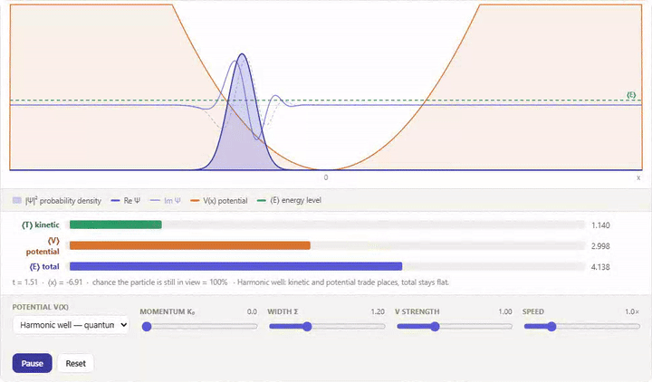
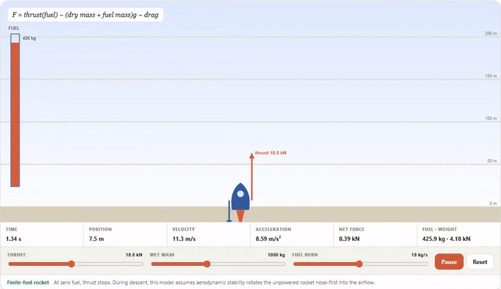
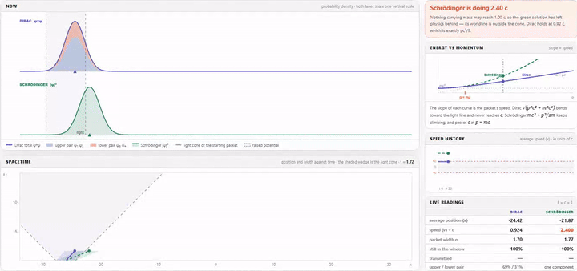
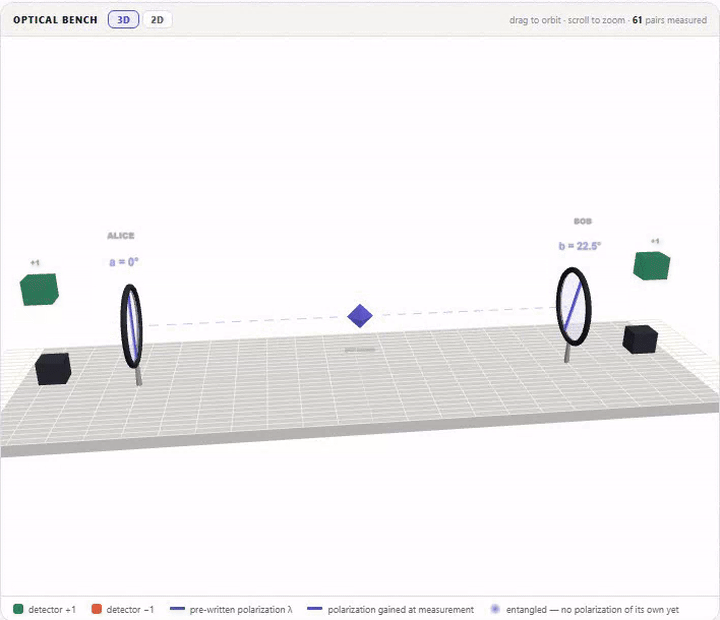

# Physics Equations Break Down

Easy, intuitive break down of physics equations — with interactive visualization.

**Live site:** [dthuong00.github.io/physics-equations](https://dthuong00.github.io/physics-equations/)

## Equations

1. **Schrödinger equation** — [live lesson](https://dthuong00.github.io/physics-equations/schrodinger-equation/)
2. **Newton's second law, F = ma** — [live lesson](https://dthuong00.github.io/physics-equations/newton-2nd-law/)
3. **Dirac equation** — [live lesson](https://dthuong00.github.io/physics-equations/dirac-equation/)
4. **Bell's inequality, |S| ≤ 2** — [live lesson](https://dthuong00.github.io/physics-equations/bell-inequality/)
5. **Relativistic energy–momentum relation, E² = p²c² + m²c⁴** — [live lesson](https://dthuong00.github.io/physics-equations/energy-momentum/)
6. **Einstein field equations** — coming soon
7. **Heisenberg's meth: uncertainty principle σₓ σₚ ≥ ℏ/2** — coming soon

<table>
  <tr>
    <td width="50%">
      
      
<b>Schrödinger equation</b> — watch a wave packet evolve

    </td>
    <td width="50%">
      
      
<b>F = ma</b> — launch a finite-fuel rocket

    </td>
  </tr>
  <tr>
    <td width="50%">
      
      
<b>Dirac equation</b> — race quantum packets against light

    </td>
    <td width="50%">
      
      
<b>Bell's inequality</b> — run a CHSH entanglement test

    </td>
  </tr>
</table>
