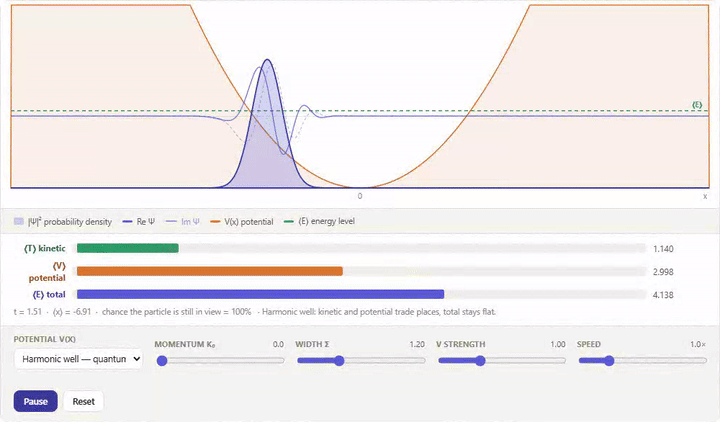
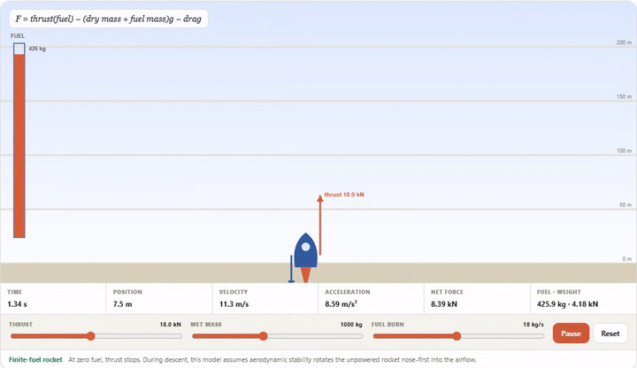
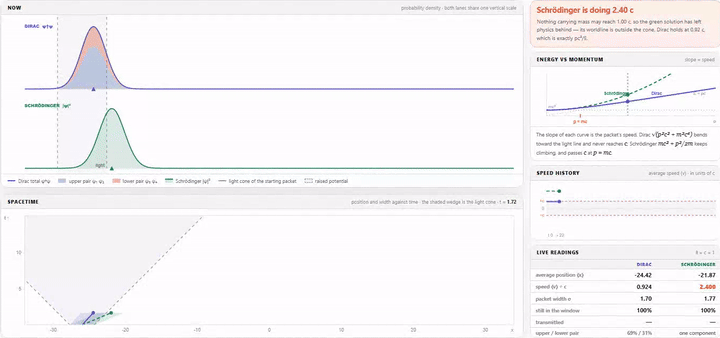
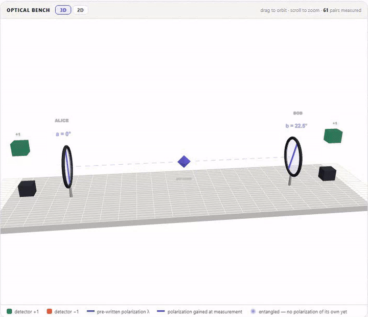

# Physics Equations BreakDowns

Easy, intuitive breakdowns of physics equations - with interactive visualization. A just-for-fun, non-profit project: free to use, no ads, no strings attached.

**Live site:** [dthuong00.github.io/physics-equations](https://dthuong00.github.io/physics-equations/)

## Equations

1. **Schrödinger equation** - [live lesson](https://dthuong00.github.io/physics-equations/schrodinger-equation/)
2. **Newton's second law, F = ma** - [live lesson](https://dthuong00.github.io/physics-equations/newton-2nd-law/)
3. **Dirac equation** - [live lesson](https://dthuong00.github.io/physics-equations/dirac-equation/)
4. **Bell's inequality, |S| ≤ 2** - coming soon
5. **Relativistic energy–momentum relation, E² = p²c² + m²c⁴** - [live lesson](https://dthuong00.github.io/physics-equations/energy-momentum/) · [tiếng Việt](https://dthuong00.github.io/physics-equations/energy-momentum/?lang=vi)
6. **Einstein field equations, Gμν + Λgμν = 8πG Tμν/c⁴** - coming soon
7. **Newton's law of gravitation, F = GMm/r²** - coming soon
8. **Navier–Stokes equations, ρ Du/Dt = −∇p + μ∇²u + ρg** - [live lesson](https://dthuong00.github.io/physics-equations/navier-stokes/) · [tiếng Việt](https://dthuong00.github.io/physics-equations/navier-stokes/?lang=vi)
9. **Heisenberg's meth: uncertainty principle σₓ σₚ ≥ ℏ/2** - coming soon
10. **Feynman diagrams: the QED perturbation series, M = Σ diagrams·αⁿ** - coming soon

<table>
  <tr>
    <td width="50%">
      
      
<b>Schrödinger equation</b> - watch a wave packet evolve

    </td>
    <td width="50%">
      
      
<b>F = ma</b> - launch a finite-fuel rocket

    </td>
  </tr>
  <tr>
    <td width="50%">
      
      
<b>Dirac equation</b> - race quantum packets against light

    </td>
    <td width="50%">
      
      
<b>Bell's inequality</b> - run a CHSH entanglement test (coming soon)

    </td>
  </tr>
</table>
